Deep Dive on Attrition
================
Stuart Miller
August 14, 2019

``` r
# import libraries
library(knitr)
library(tidyverse)
library(naniar)
library(Hmisc)
library(GGally)
library(gridExtra)
library(RColorBrewer)
library(gplots)
library(corrplot)
library(ggthemes)

# import helper functions
source('../helper/data_munging.R')
source('../helper/visual.R')

# read in data
train <- read_csv('../data/CaseStudy2-data_train.csv')

# create a vector of numeric features
features.numeric <- c('DailyRate', 'DistanceFromHome', 'Age', 'HourlyRate', 'MonthlyIncome', 'MonthlyRate',
           'NumCompaniesWorked','PercentSalaryHike', 'TotalWorkingYears', 'TrainingTimesLastYear',
           'YearsAtCompany','YearsInCurrentRole','YearsSinceLastPromotion', 'YearsWithCurrManager')

# create a vector of numeric features
features.factor <- c('BusinessTravel', 'Department', 'Education', 'EducationField',
                     'EnvironmentSatisfaction', 'Gender', 'JobInvolvement', 'JobLevel',
                     'JobRole', 'JobSatisfaction', 'MaritalStatus', 'OverTime',
                     'PerformanceRating', 'RelationshipSatisfaction', 'StockOptionLevel',
                     'WorkLifeBalance', 'Attrition')

# factor categorical variables
train[, features.factor] <- lapply(train[, features.factor], as.factor)
```

## Analysis of Attrtion

The objective is to find where high attrition is correlated. Based on
previous EDA, the following variables (or levels of variables) seem to
be associated with attrition. The top 3 factors associated with
attrition are numbered. The top 3 factors associated with attrition are
examinated in association to other relative factors.

**Factor**

  - JobInvolvement - 1
  - WorkLifeBalance - 2
  - OverTime - 3
  - JobRole
  - JobLevel
  - JobSatisfaction

**Numeric**

  - MonthlyIncome
  - TotalWorkingYears
  - YearsInCurrentRole
  - YearsWithCurrmanager

## Job Involvement

Job involvement appears to have a high impact on employee attrition.
Nearly 50% with the lowest job involvement leave the position. It is
expected that there would be an interaction with `JobRole`, `JobLevel`,
and `OverTime`.

``` r
train %>% ggplot(aes(x = JobInvolvement, fill = Attrition)) +
  geom_bar(position = 'fill') +
  coord_flip() + 
  scale_fill_few(palette = 'Dark') + 
  theme_few()
```

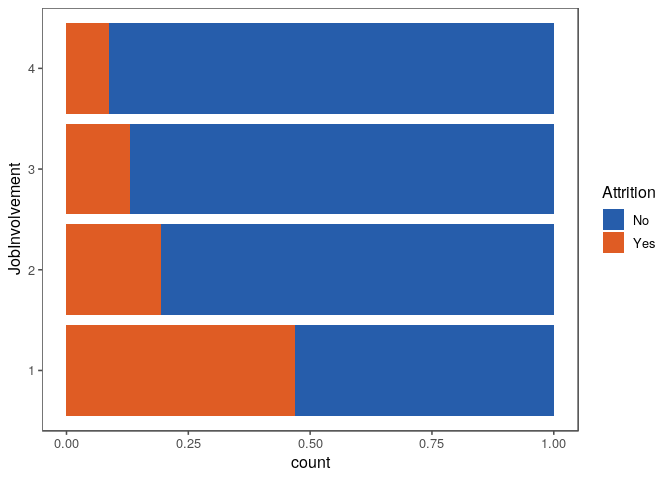<!-- -->

### Job Role Interaction

Almost all job roles show high attrition with low job involvement. With
Human Resources and Sales Representative having the worst rates.
Notibly, attrition rates of Manufacturing Director and Research Director
do not seem to be affected by job involvement.

``` r
train %>% ggplot(aes(x = JobInvolvement, fill = Attrition)) +
  geom_bar(position = 'fill') +
  coord_flip() +
  facet_wrap( ~ JobRole) + 
  scale_fill_few(palette = 'Dark') + 
  theme_few()
```

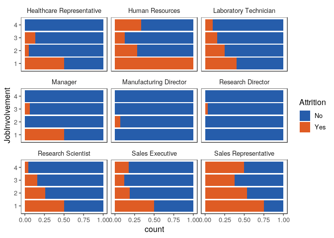<!-- -->

### Job Level Interaction

Attriton is high for all job levels where job level is low. It is
especially high (over 50%) in level 1 and 5.

``` r
train %>% ggplot(aes(x = JobInvolvement, fill = Attrition)) +
  geom_bar(position = 'fill') +
  coord_flip() +
  facet_wrap( ~ JobLevel) + 
  scale_fill_few(palette = 'Dark') + 
  theme_few()
```

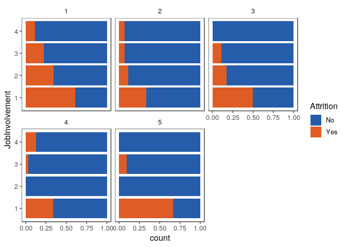<!-- -->

### Overtime Interaction

Attrition is higher for eac level of job involvement, but it is also
generally higher for Overtime workers.

``` r
train %>% ggplot(aes(x = JobInvolvement, fill = Attrition)) +
  geom_bar(position = 'fill') +
  coord_flip() +
  facet_wrap( ~ OverTime) + 
  scale_fill_few(palette = 'Dark') + 
  theme_few()
```

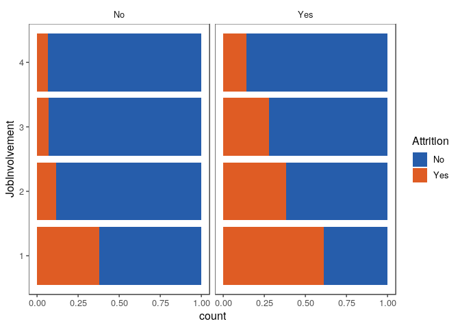<!-- -->

## Work-Life Balence

Work-life balence appears to have a high impact on employee attrition.
Nearly 50% with the lowest job involvement leave the position. It is
expected that there would be an interaction with `JobRole`, `JobLevel`,
and `OverTime`.

``` r
train %>% ggplot(aes(x = WorkLifeBalance, fill = Attrition)) +
  geom_bar(position = 'fill') +
  coord_flip() + 
  scale_fill_few(palette = 'Dark') + 
  theme_few()
```

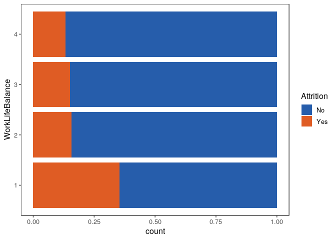<!-- -->

### Job Role Interaction

Sales Executives and Laboratory Technitions with low work-life balence
have high attrition rates.

``` r
train %>% ggplot(aes(x = WorkLifeBalance, fill = Attrition)) +
  geom_bar(position = 'fill') +
  coord_flip() +
  facet_wrap( ~ JobRole) + 
  scale_fill_few(palette = 'Dark') + 
  theme_few()
```

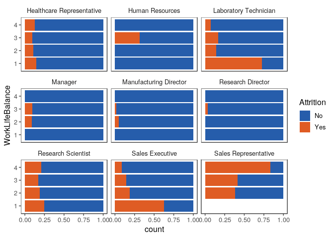<!-- -->

### Job Level Interaction

Low work-life balence appears to have an affect on lower job levels,
especially level 1.

``` r
train %>% ggplot(aes(x = WorkLifeBalance, fill = Attrition)) +
  geom_bar(position = 'fill') +
  coord_flip() +
  facet_wrap( ~ JobLevel) + 
  scale_fill_few(palette = 'Dark') + 
  theme_few()
```

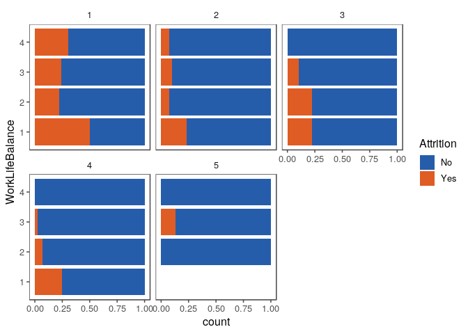<!-- -->

### Overtime Interaction

Attrition is higher for each level of job involvement, but it is also
generally higher for Overtime workers.

``` r
train %>% ggplot(aes(x = WorkLifeBalance, fill = Attrition)) +
  geom_bar(position = 'fill') +
  coord_flip() +
  facet_wrap( ~ OverTime) + 
  scale_fill_few(palette = 'Dark') + 
  theme_few()
```

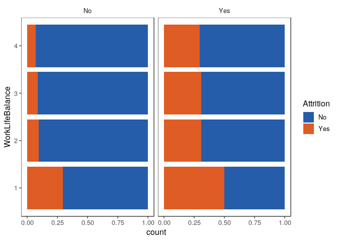<!-- -->

## Overtime

Job involvement appears to have a high impact on employee attrition.
Nearly 50% with the lowest job involvement leave the position. It is
expected that there would be an interaction with `JobRole`, `JobLevel`,
and `MonthlyIncome`.

``` r
train %>% ggplot(aes(x = OverTime, fill = Attrition)) +
  geom_bar(position = 'fill') +
  coord_flip() + 
  scale_fill_few(palette = 'Dark') + 
  theme_few()
```

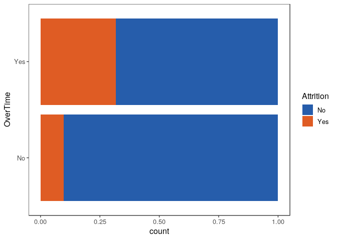<!-- -->

### Job Role Interaction

Sales Executives and Laboratory Technitions with low work-life balence
have high attrition rates.

``` r
train %>% ggplot(aes(x = OverTime, fill = Attrition)) +
  geom_bar(position = 'fill') +
  coord_flip() +
  facet_wrap( ~ JobRole) + 
  scale_fill_few(palette = 'Dark') + 
  theme_few()
```

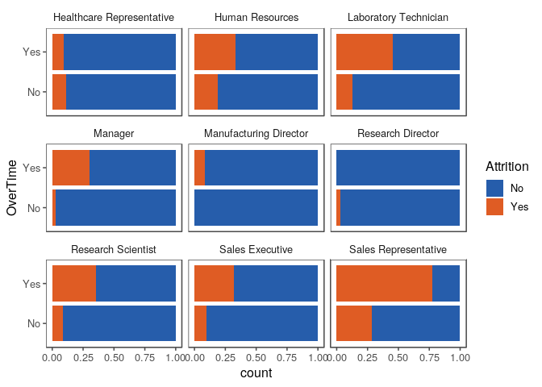<!-- -->

### Job Level Interaction

Low work-life balence appears to have an affect on lower job levels,
especially level 1.

``` r
train %>% ggplot(aes(x = OverTime, fill = Attrition)) +
  geom_bar(position = 'fill') +
  coord_flip() +
  facet_wrap( ~ JobLevel) + 
  scale_fill_few(palette = 'Dark') + 
  theme_few()
```

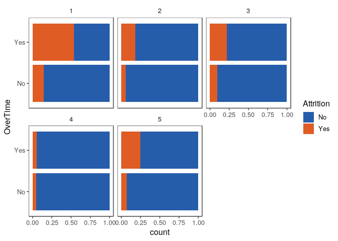<!-- -->

### MonthlyIncome Interaction

Monthly income appears to be lower for employees who are working
overtime with attrition.

``` r
train %>% 
  ggplot(aes(x = Attrition,
             y = MonthlyIncome,
             fill = Attrition)) +
  geom_boxplot() + 
  facet_wrap(~ OverTime) +
  scale_fill_few(palette = 'Dark') + 
  theme_few() +
  ggtitle('MonthlyIncome by Attrition and Overtime')
```

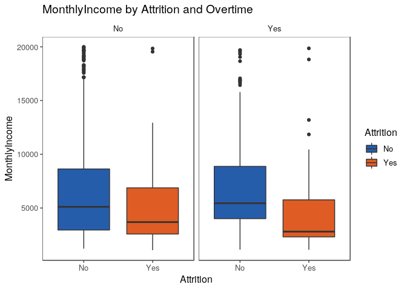<!-- -->
