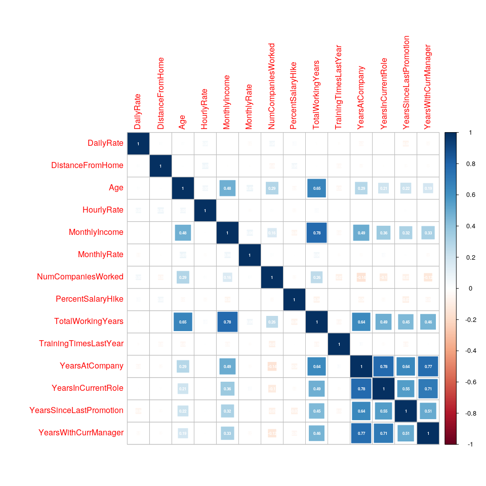
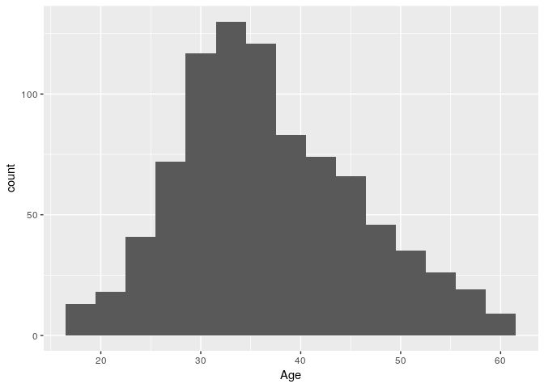
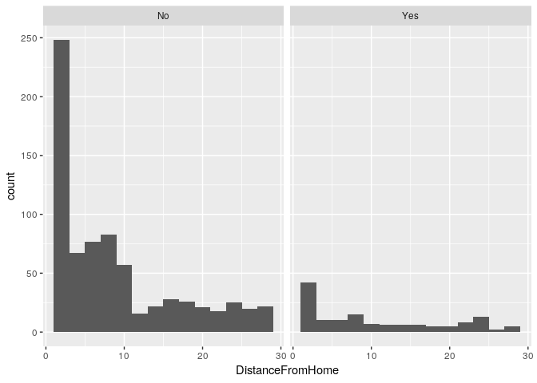
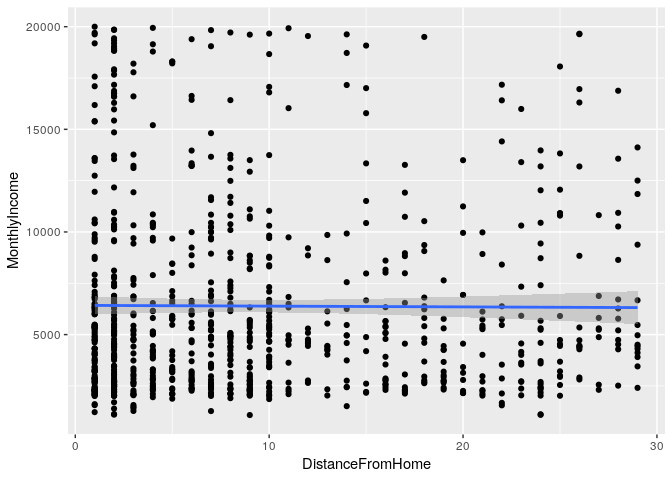
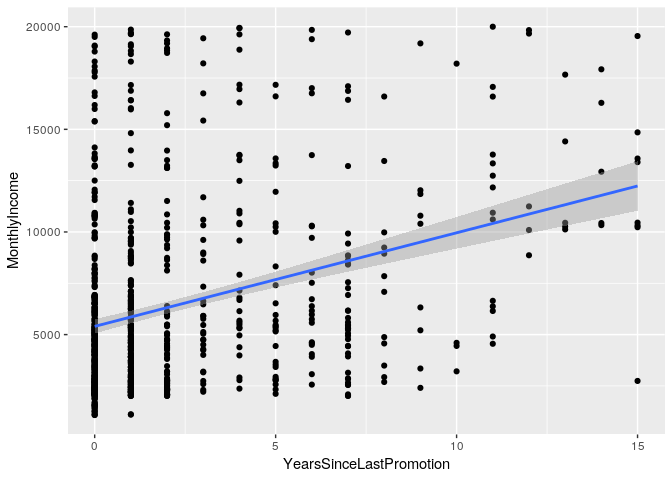
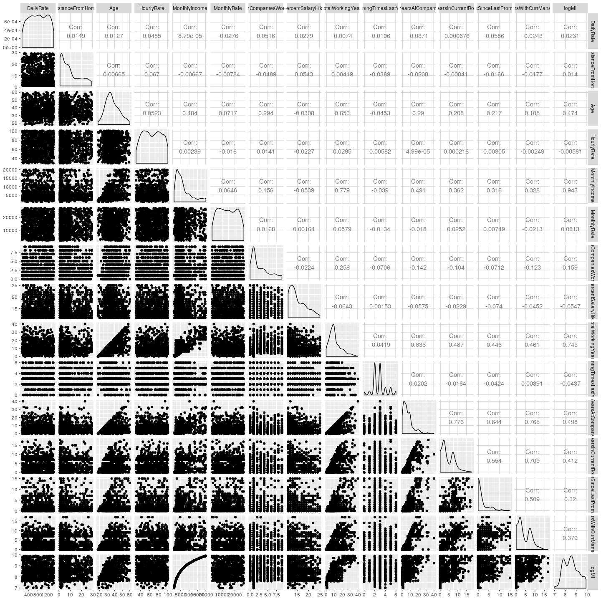

Exploratory Data Analysis
================
Stuart Miller
August 4, 2019

# Setup Environment

``` r
# import libraries
library(knitr)
library(tidyverse)
library(naniar)
library(Hmisc)
library(GGally)
library(gridExtra)
library(RColorBrewer)
library(gplots)
library(corrplot)
library(ggthemes)

# import helper functions
source('../helper/data_munging.R')
source('../helper/visual.R')

# read in data
train <- read_csv('../data/CaseStudy2-data_train.csv')
```

# Data Exploration

A data dictionary was not given. So start by exploring the variables to
get a sense of what is included. A simple data dictionary will be built.
See ‘./analysis/data/README.md’ for more details.

``` r
names(train)
```

    ##  [1] "ID"                       "Age"                     
    ##  [3] "Attrition"                "BusinessTravel"          
    ##  [5] "DailyRate"                "Department"              
    ##  [7] "DistanceFromHome"         "Education"               
    ##  [9] "EducationField"           "EmployeeCount"           
    ## [11] "EmployeeNumber"           "EnvironmentSatisfaction" 
    ## [13] "Gender"                   "HourlyRate"              
    ## [15] "JobInvolvement"           "JobLevel"                
    ## [17] "JobRole"                  "JobSatisfaction"         
    ## [19] "MaritalStatus"            "MonthlyIncome"           
    ## [21] "MonthlyRate"              "NumCompaniesWorked"      
    ## [23] "Over18"                   "OverTime"                
    ## [25] "PercentSalaryHike"        "PerformanceRating"       
    ## [27] "RelationshipSatisfaction" "StandardHours"           
    ## [29] "StockOptionLevel"         "TotalWorkingYears"       
    ## [31] "TrainingTimesLastYear"    "WorkLifeBalance"         
    ## [33] "YearsAtCompany"           "YearsInCurrentRole"      
    ## [35] "YearsSinceLastPromotion"  "YearsWithCurrManager"

# Reponse Variables

Two models are requested

  - A model for salary, which is given as `MonthlyIncome` in the
    dataset.
  - A model for attrition, which is given as `Attrition` in the dataset.

Histogram of monthly income reveals that it is highly skewed to the
right.

``` r
# histogram of MonthlyIncome
train %>% ggplot(aes(x = MonthlyIncome)) +
  geom_histogram(bins = 15)
```

<!-- -->

``` r
# histogram of MonthlyIncome
train %>% ggplot(aes(x = log(MonthlyIncome))) +
  geom_histogram(bins = 15)
```

<!-- -->

A bar plot of Attrition reveals that the response variable is highly
imbalanced.

``` r
# histogram of Attrition
train %>% ggplot(aes(x = Attrition)) +
  geom_bar()
```

<!-- -->

# Explanatory - Continuous Variables

Exploration of the continuous variables.

``` r
# create a vector of numeric features
features.numeric <- c('DailyRate', 'DistanceFromHome', 'Age', 'HourlyRate', 'MonthlyIncome', 'MonthlyRate',
           'NumCompaniesWorked','PercentSalaryHike', 'TotalWorkingYears', 'TrainingTimesLastYear',
           'YearsAtCompany','YearsInCurrentRole','YearsSinceLastPromotion', 'YearsWithCurrManager')
```

Explore features in isolation and the relationship between features and
the response variables.

**Correlation to Response**

The following table ranks features in order of descending correlation to
`MonthlyIncome`.

``` r
train.numeric <- train %>% select(features.numeric)

correlation.matrix <- rcorr(as.matrix(train.numeric))
train.corToMI <- data.frame(flattenCorrMatrix(correlation.matrix$r, correlation.matrix$P)) %>% 
  filter(row == 'MonthlyIncome' | column == 'MonthlyIncome') %>%
  mutate(cor = abs(cor)) %>%
  arrange(-cor)
kable(train.corToMI)
```

| row              | column                  |       cor |         p |
| :--------------- | :---------------------- | --------: | --------: |
| MonthlyIncome    | TotalWorkingYears       | 0.7785112 | 0.0000000 |
| MonthlyIncome    | YearsAtCompany          | 0.4913790 | 0.0000000 |
| Age              | MonthlyIncome           | 0.4842883 | 0.0000000 |
| MonthlyIncome    | YearsInCurrentRole      | 0.3618405 | 0.0000000 |
| MonthlyIncome    | YearsWithCurrManager    | 0.3284875 | 0.0000000 |
| MonthlyIncome    | YearsSinceLastPromotion | 0.3159116 | 0.0000000 |
| MonthlyIncome    | NumCompaniesWorked      | 0.1558943 | 0.0000038 |
| MonthlyIncome    | MonthlyRate             | 0.0645941 | 0.0568449 |
| MonthlyIncome    | PercentSalaryHike       | 0.0538659 | 0.1123575 |
| MonthlyIncome    | TrainingTimesLastYear   | 0.0390146 | 0.2503303 |
| DistanceFromHome | MonthlyIncome           | 0.0066672 | 0.8443188 |
| HourlyRate       | MonthlyIncome           | 0.0023912 | 0.9438534 |
| DailyRate        | MonthlyIncome           | 0.0000879 | 0.9979342 |

**Correlation Heatmap**

`TotalworkingYears`, `Age`, `YearsAtCompany`, `YearsInCurrentRole`, and
`YearsWithCurrentManager`.

``` r
heatmap.cor <- function(df){
  df %>%
    keep(is.numeric) %>%
    drop_na() %>%
    cor %>%
    corrplot( addCoef.col = 'white',
             number.digits = 2,
             number.cex = 0.5,
             method = 'square')
}
heatmap.cor(train.numeric)
```

<!-- -->

**Variance of Features**

The following table ranks features in order of descending standard
deviation.

``` r
# get varaince table
temp.table <- train %>%
  select(features.numeric) %>%
  summarise_all(funs(sd(.))) %>%
  rownames_to_column %>%
  gather(var, value, -rowname) %>%
  arrange(-value) %>%
  select(-one_of(c('rowname')))
# rename columns for clairity and print markdown table
names(temp.table) <- c('Feature','Standard Deviation')
kable(temp.table)
```

| Feature                 | Standard Deviation |
| :---------------------- | -----------------: |
| MonthlyRate             |        7108.381928 |
| MonthlyIncome           |        4597.695974 |
| DailyRate               |         401.116280 |
| HourlyRate              |          20.127163 |
| Age                     |           8.925950 |
| DistanceFromHome        |           8.136704 |
| TotalWorkingYears       |           7.513668 |
| YearsAtCompany          |           6.021036 |
| PercentSalaryHike       |           3.675440 |
| YearsInCurrentRole      |           3.639317 |
| YearsWithCurrManager    |           3.574441 |
| YearsSinceLastPromotion |           3.185872 |
| NumCompaniesWorked      |           2.520443 |
| TrainingTimesLastYear   |           1.272665 |

**Density Plots of All Numeric Features**

``` r
train %>% keep(is.numeric) %>% 
  gather() %>% 
  ggplot(aes(x = value)) + 
  facet_wrap(~ key, scales = 'free') + 
  geom_density() 
```

<!-- -->

**`Age` exploration**

There appears to be a relationship between `Age` and `MonthlyIncome`. A
relationship between `Age` and `Attrition` is not clear.

``` r
train %>% ggplot(aes(x = Age)) + 
  geom_histogram(bins = 15)
```

<!-- -->

``` r
train %>% ggplot(aes(x = Age)) + 
  geom_histogram(bins = 15) + 
  facet_wrap(~ Attrition)
```

<!-- -->

``` r
train %>% ggplot(aes(x = Age, y = MonthlyIncome)) + 
  geom_point() + geom_smooth(method = 'lm')
```

<!-- -->

**`DailyRate` exploration**

There does not appear to be a correlation between `DailyRate` and either
outcome variable.

``` r
train %>% ggplot(aes(x = DailyRate)) + 
  geom_histogram(bins = 15)
```

<!-- -->

``` r
train %>% ggplot(aes(x = DailyRate)) + 
  geom_histogram(bins = 15) + 
  facet_wrap(~ Attrition)
```

<!-- -->

``` r
train %>% ggplot(aes(x = DailyRate, y = MonthlyIncome)) + 
  geom_point() + geom_smooth(method = 'lm')
```

<!-- -->

**`DistanceFromHome` exploration**

There does not appear to be a correlation between `DistanceFromHome` and
either outcome variable.

``` r
train %>% ggplot(aes(x = DistanceFromHome)) + 
  geom_histogram(bins = 15)
```

<!-- -->

``` r
train %>% ggplot(aes(x = DistanceFromHome)) + 
  geom_histogram(bins = 15) + 
  facet_wrap(~ Attrition)
```

<!-- -->

``` r
train %>% ggplot(aes(x = DistanceFromHome, y = MonthlyIncome)) + 
  geom_point() + geom_smooth(method = 'lm')
```

<!-- -->

**`MonthlyRate` exploration**

There does not appear to be a correlation between `MonthlyRate` and
either outcome variable.

``` r
train %>% ggplot(aes(x = MonthlyRate)) + 
  geom_histogram(bins = 15)
```

<!-- -->

``` r
train %>% ggplot(aes(x = MonthlyRate)) + 
  geom_histogram(bins = 15) + 
  facet_wrap(~ Attrition)
```

<!-- -->

``` r
train %>% ggplot(aes(x = MonthlyRate, y = MonthlyIncome)) + 
  geom_point() + geom_smooth(method = 'lm')
```

<!-- -->

**`PercentSalaryHike` exploration**

There does not appear to be a correlation between `PercentSalaryHike`
and either outcome variable.

``` r
train %>% ggplot(aes(x = PercentSalaryHike)) + 
  geom_histogram()
```

    ## `stat_bin()` using `bins = 30`. Pick better value with `binwidth`.

<!-- -->

``` r
train %>% ggplot(aes(x = PercentSalaryHike)) + 
  geom_histogram() + 
  facet_wrap(~ Attrition)
```

    ## `stat_bin()` using `bins = 30`. Pick better value with `binwidth`.

<!-- -->

``` r
train %>% ggplot(aes(x = PercentSalaryHike, y = MonthlyIncome)) + 
  geom_point() + geom_smooth(method = 'lm')
```

<!-- -->

**`TotalWorkingYears` exploration**

There does appear to be a correlation between `TotalWorkingYears` and
`MonthlyIncome`.

``` r
train %>% ggplot(aes(x = TotalWorkingYears)) + 
  geom_histogram(bins = 15)
```

<!-- -->

``` r
train %>% ggplot(aes(x = TotalWorkingYears)) + 
  geom_histogram(bins = 15) + 
  facet_wrap(~ Attrition)
```

<!-- -->

``` r
train %>% ggplot(aes(x = TotalWorkingYears, y = MonthlyIncome)) + 
  geom_point() + geom_smooth(method = 'lm')
```

<!-- -->

**`TrainingTimesLastYear` exploration**

There does not appear to be a correlation between
`TrainingTimesLastYear` and either outcome variable.

``` r
train %>% ggplot(aes(x = TrainingTimesLastYear)) + 
  geom_histogram(bins = 15)
```

<!-- -->

``` r
train %>% ggplot(aes(x = TrainingTimesLastYear)) + 
  geom_histogram(bins = 15) + 
  facet_wrap(~ Attrition)
```

<!-- -->

``` r
train %>% ggplot(aes(x = TrainingTimesLastYear, y = MonthlyIncome)) + 
  geom_point() + geom_smooth(method = 'lm')
```

<!-- -->

**`YearsAtCompany` exploration**

There does appear to be a correlation between `YearsAtCompany` and
`MonthlyIncome`.

``` r
train %>% ggplot(aes(x = YearsAtCompany)) + 
  geom_histogram(bins = 15)
```

<!-- -->

``` r
train %>% ggplot(aes(x = YearsAtCompany)) + 
  geom_histogram(bins = 15) + 
  facet_wrap(~ Attrition)
```

<!-- -->

``` r
train %>% ggplot(aes(x = YearsAtCompany, y = MonthlyIncome)) + 
  geom_point() + geom_smooth(method = 'lm')
```

<!-- -->

**`YearsInCurrentRole` exploration**

There does appear to be a correlation between `YearsInCurrentRole` and
`MonthlyIncome`.

``` r
train %>% ggplot(aes(x = YearsInCurrentRole)) + 
  geom_histogram(bins = 15)
```

<!-- -->

``` r
train %>% ggplot(aes(x = YearsInCurrentRole)) + 
  geom_histogram(bins = 15) + 
  facet_wrap(~ Attrition)
```

<!-- -->

``` r
train %>% ggplot(aes(x = YearsInCurrentRole, y = MonthlyIncome)) + 
  geom_point() + geom_smooth(method = 'lm')
```

<!-- -->

**`YearsSinceLastPromotion` exploration**

There does appear to be a correlation between `YearsSinceLastPromotion`
and `MonthlyIncome`.

``` r
train %>% ggplot(aes(x = YearsSinceLastPromotion)) + 
  geom_histogram(bins = 15)
```

<!-- -->

``` r
train %>% ggplot(aes(x = YearsSinceLastPromotion)) + 
  geom_histogram(bins = 15) + 
  facet_wrap(~ Attrition)
```

<!-- -->

``` r
train %>% ggplot(aes(x = YearsSinceLastPromotion, y = MonthlyIncome)) + 
  geom_point() + geom_smooth(method = 'lm')
```

<!-- -->

**`YearsWithCurrManager` exploration**

There does not appear to be a correlation between `YearsWithCurrManager`
and either outcome variable.

``` r
train %>% ggplot(aes(x = YearsWithCurrManager)) + 
  geom_histogram(bins = 15)
```

<!-- -->

``` r
train %>% ggplot(aes(x = YearsWithCurrManager)) + 
  geom_histogram(bins = 15) + 
  facet_wrap(~ Attrition)
```

<!-- -->

``` r
train %>% ggplot(aes(x = YearsWithCurrManager, y = MonthlyIncome)) + 
  geom_point() + geom_smooth(method = 'lm')
```

<!-- -->

## Multivariate Exploration

Scatter plot and correlation matrix gives a board overview of
correlations between continuous variables.

  - `MonthlyIncome` appears to be correlated with `Age` and
    `TotalWorkingYears`
  - `YearsAtCompany`,`YearsInCurrentRole`,`YearsSinceLastPromotion`,
    `YearsWithCurrManager`, `TotalWorkingYears`, and `Age` appear to be
    correlated.

<!-- end list -->

``` r
train %>%
  select(c(features.numeric)) %>%
  ggpairs()
```

<!-- -->

**Look at log of MonthlyIncome `logMI` because MonthlyIncome is right
skewed**

``` r
train <- train %>% mutate(logMI = log(MonthlyIncome))
train %>%
  select(c(features.numeric, 'logMI')) %>%
  ggpairs()
```

<!-- -->

**Close up of MonthlyIncome and highest correlated features**

Taking the log of MonthlyIncome does not appear to improve linear
correlation.

``` r
train %>%
  select(c('logMI','MonthlyIncome','Age','TotalWorkingYears','YearsAtCompany','YearsInCurrentRole',
           'YearsSinceLastPromotion','YearsWithCurrManager')) %>%
  ggpairs()
```

<!-- -->

From the plot above, several of the variables appear to be linearly
related: `YearsAtCompany` vs `YearsWithCurrManager`,
`YearsInCurrentRole` and `YearsSinceLastPromotion`. This could be an
interesting trend in the data.

``` r
p1 <- train %>% filter(YearsAtCompany > 0) %>%
  ggplot(aes(x = YearsWithCurrManager, y = YearsAtCompany)) + 
  geom_point() + geom_smooth(method = 'lm')
p2 <- train %>% filter(YearsAtCompany > 0) %>%
  ggplot(aes(x = YearsInCurrentRole, y = YearsAtCompany)) + 
  geom_point() + geom_smooth(method = 'lm')
p3 <- train %>% filter(YearsAtCompany > 0) %>%
  ggplot(aes(x = YearsSinceLastPromotion, y = YearsAtCompany)) + 
  geom_point() + geom_smooth(method = 'lm')
grid.arrange(p1,p2,p3, ncol = 2)
```

<!-- -->

``` r
m.YearsAtCompany <- train %>% 
  filter(YearsAtCompany > 0) %>% 
  lm(log(YearsAtCompany) ~ YearsSinceLastPromotion +  YearsInCurrentRole + YearsWithCurrManager, data = .)

summary(m.YearsAtCompany)
```

    ## 
    ## Call:
    ## lm(formula = log(YearsAtCompany) ~ YearsSinceLastPromotion + 
    ##     YearsInCurrentRole + YearsWithCurrManager, data = .)
    ## 
    ## Residuals:
    ##      Min       1Q   Median       3Q      Max 
    ## -1.13397 -0.36114  0.02062  0.30107  1.57553 
    ## 
    ## Coefficients:
    ##                         Estimate Std. Error t value Pr(>|t|)    
    ## (Intercept)             0.608360   0.024460  24.872  < 2e-16 ***
    ## YearsSinceLastPromotion 0.022474   0.005623   3.997 6.99e-05 ***
    ## YearsInCurrentRole      0.108390   0.006035  17.960  < 2e-16 ***
    ## YearsWithCurrManager    0.115189   0.005946  19.373  < 2e-16 ***
    ## ---
    ## Signif. codes:  0 '***' 0.001 '**' 0.01 '*' 0.05 '.' 0.1 ' ' 1
    ## 
    ## Residual standard error: 0.4311 on 838 degrees of freedom
    ## Multiple R-squared:  0.767,  Adjusted R-squared:  0.7662 
    ## F-statistic: 919.7 on 3 and 838 DF,  p-value: < 2.2e-16

``` r
train %>% filter(YearsAtCompany > 0) %>%basic.fit.plots(., m.YearsAtCompany)
```

<!-- -->

# Explanatory - factor Variables

Exploration of the continuous variables.

For investigation of the categrical variables, we will look at variables
correlated to monthly income. Monthly income is correlated with
`TotalworkingYears`, `Age`, `YearsAtCompany`, `YearsInCurrentRole`, and
`YearsWithCurrentManager`.

``` r
# create a vector of numeric features
features.factor <- c('BusinessTravel', 'Department', 'Education', 'EducationField', 'EmployeeNumber', 'EnvironmentSatisfaction', 'Gender', 'JobInvolvement', 'JobLevel', 'JobRole', 'JobSatisfaction', 'MaritalStatus', 'OverTime', 'PerformanceRating', 'RelationshipSatisfaction', 'StockOptionLevel', 'WorkLifeBalance')

# factor categorical variables
train[, features.factor] <- lapply(train[, features.factor], as.factor)
```

## BusinessTravel

``` r
btMI <- train %>% 
  ggplot(aes(x = BusinessTravel,
             y = log(MonthlyIncome),
             fill = BusinessTravel)) +
  geom_boxplot() + 
  scale_fill_few(palette = 'Dark') + 
  theme_few()

btAg <- train %>% 
  ggplot(aes(x = BusinessTravel,
             y = Age,
             fill = BusinessTravel)) +
  geom_boxplot() + 
  scale_fill_few(palette = 'Dark') + 
  theme_few()

btYAC <- train %>% 
  ggplot(aes(x = BusinessTravel,
             y = YearsAtCompany,
             fill = BusinessTravel)) +
  geom_boxplot() + 
  scale_fill_few(palette = 'Dark') + 
  theme_few()

btYCM <- train %>% 
  ggplot(aes(x = BusinessTravel,
             y = YearsWithCurrManager,
             fill = BusinessTravel)) +
  geom_boxplot() + 
  scale_fill_few(palette = 'Dark') + 
  theme_few()

btTWY <- train %>% 
  ggplot(aes(x = BusinessTravel,
             y = TotalWorkingYears,
             fill = BusinessTravel)) +
  geom_boxplot() + 
  scale_fill_few(palette = 'Dark') + 
  theme_few()

grid.arrange(btMI, btAg, btYAC, btYCM, btTWY)
```

<!-- -->

``` r
btMI <- train %>% 
  ggplot(aes(x = Gender,
             y = log(MonthlyIncome),
             fill = Gender)) +
  geom_boxplot() + 
  scale_fill_few(palette = 'Dark') + 
  theme_few()

btAg <- train %>% 
  ggplot(aes(x = Gender,
             y = Age,
             fill = Gender)) +
  geom_boxplot() + 
  scale_fill_few(palette = 'Dark') + 
  theme_few()

btYAC <- train %>% 
  ggplot(aes(x = Gender,
             y = YearsAtCompany,
             fill = Gender)) +
  geom_boxplot() + 
  scale_fill_few(palette = 'Dark') + 
  theme_few()

btYCM <- train %>% 
  ggplot(aes(x = Gender,
             y = YearsWithCurrManager,
             fill = Gender)) +
  geom_boxplot() + 
  scale_fill_few(palette = 'Dark') + 
  theme_few()

btTWY <- train %>% 
  ggplot(aes(x = Gender,
             y = TotalWorkingYears,
             fill = Gender)) +
  geom_boxplot() + 
  scale_fill_few(palette = 'Dark') + 
  theme_few()

grid.arrange(btMI, btAg, btYAC, btYCM, btTWY)
```

<!-- -->

``` r
btMI <- train %>% 
  ggplot(aes(x = Department,
             y = log(MonthlyIncome),
             fill = Department)) +
  geom_boxplot() + 
  scale_fill_few(palette = 'Dark') + 
  theme_few()

btAg <- train %>% 
  ggplot(aes(x = Department,
             y = Age,
             fill = Department)) +
  geom_boxplot() + 
  scale_fill_few(palette = 'Dark') + 
  theme_few()

btYAC <- train %>% 
  ggplot(aes(x = Department,
             y = YearsAtCompany,
             fill = Department)) +
  geom_boxplot() + 
  scale_fill_few(palette = 'Dark') + 
  theme_few()

btYCM <- train %>% 
  ggplot(aes(x = Department,
             y = YearsWithCurrManager,
             fill = Department)) +
  geom_boxplot() + 
  scale_fill_few(palette = 'Dark') + 
  theme_few()

btTWY <- train %>% 
  ggplot(aes(x = Department,
             y = TotalWorkingYears,
             fill = Department)) +
  geom_boxplot() + 
  scale_fill_few(palette = 'Dark') + 
  theme_few()

grid.arrange(btMI, btAg, btYAC, btYCM, btTWY)
```

<!-- -->

``` r
btMI <- train %>% 
  ggplot(aes(x = Education,
             y = log(MonthlyIncome),
             fill = Education)) +
  geom_boxplot() + 
  scale_fill_few(palette = 'Dark') + 
  theme_few()

btAg <- train %>% 
  ggplot(aes(x = Education,
             y = Age,
             fill = Education)) +
  geom_boxplot() + 
  scale_fill_few(palette = 'Dark') + 
  theme_few()

btYAC <- train %>% 
  ggplot(aes(x = Education,
             y = YearsAtCompany,
             fill = Education)) +
  geom_boxplot() + 
  scale_fill_few(palette = 'Dark') + 
  theme_few()

btYCM <- train %>% 
  ggplot(aes(x = Education,
             y = YearsWithCurrManager,
             fill = Education)) +
  geom_boxplot() + 
  scale_fill_few(palette = 'Dark') + 
  theme_few()

btTWY <- train %>% 
  ggplot(aes(x = Education,
             y = TotalWorkingYears,
             fill = Education)) +
  geom_boxplot() + 
  scale_fill_few(palette = 'Dark') + 
  theme_few()

grid.arrange(btMI, btAg, btYAC, btYCM, btTWY)
```

<!-- -->

``` r
btMI <- train %>% 
  ggplot(aes(x = EducationField,
             y = log(MonthlyIncome),
             fill = EducationField)) +
  geom_boxplot() + 
  scale_fill_few(palette = 'Dark') + 
  theme_few()

btAg <- train %>% 
  ggplot(aes(x = EducationField,
             y = Age,
             fill = EducationField)) +
  geom_boxplot() + 
  scale_fill_few(palette = 'Dark') + 
  theme_few()

btYAC <- train %>% 
  ggplot(aes(x = EducationField,
             y = YearsAtCompany,
             fill = EducationField)) +
  geom_boxplot() + 
  scale_fill_few(palette = 'Dark') + 
  theme_few()

btYCM <- train %>% 
  ggplot(aes(x = EducationField,
             y = YearsWithCurrManager,
             fill = EducationField)) +
  geom_boxplot() + 
  scale_fill_few(palette = 'Dark') + 
  theme_few()

btTWY <- train %>% 
  ggplot(aes(x = EducationField,
             y = TotalWorkingYears,
             fill = EducationField)) +
  geom_boxplot() + 
  scale_fill_few(palette = 'Dark') + 
  theme_few()

grid.arrange(btMI, btAg, btYAC, btYCM, btTWY)
```

<!-- -->

``` r
btMI <- train %>% 
  ggplot(aes(x = EnvironmentSatisfaction,
             y = log(MonthlyIncome),
             fill = EnvironmentSatisfaction)) +
  geom_boxplot() + 
  scale_fill_few(palette = 'Dark') + 
  theme_few()

btAg <- train %>% 
  ggplot(aes(x = EnvironmentSatisfaction,
             y = Age,
             fill = EnvironmentSatisfaction)) +
  geom_boxplot() + 
  scale_fill_few(palette = 'Dark') + 
  theme_few()

btYAC <- train %>% 
  ggplot(aes(x = EnvironmentSatisfaction,
             y = YearsAtCompany,
             fill = EnvironmentSatisfaction)) +
  geom_boxplot() + 
  scale_fill_few(palette = 'Dark') + 
  theme_few()

btYCM <- train %>% 
  ggplot(aes(x = EnvironmentSatisfaction,
             y = YearsWithCurrManager,
             fill = EnvironmentSatisfaction)) +
  geom_boxplot() + 
  scale_fill_few(palette = 'Dark') + 
  theme_few()

btTWY <- train %>% 
  ggplot(aes(x = EnvironmentSatisfaction,
             y = TotalWorkingYears,
             fill = EnvironmentSatisfaction)) +
  geom_boxplot() + 
  scale_fill_few(palette = 'Dark') + 
  theme_few()

grid.arrange(btMI, btAg, btYAC, btYCM, btTWY)
```

<!-- -->

``` r
btMI <- train %>% 
  ggplot(aes(x = JobInvolvement,
             y = log(MonthlyIncome),
             fill = JobInvolvement)) +
  geom_boxplot() + 
  scale_fill_few(palette = 'Dark') + 
  theme_few()

btAg <- train %>% 
  ggplot(aes(x = JobInvolvement,
             y = Age,
             fill = JobInvolvement)) +
  geom_boxplot() + 
  scale_fill_few(palette = 'Dark') + 
  theme_few()

btYAC <- train %>% 
  ggplot(aes(x = JobInvolvement,
             y = YearsAtCompany,
             fill = JobInvolvement)) +
  geom_boxplot() + 
  scale_fill_few(palette = 'Dark') + 
  theme_few()

btYCM <- train %>% 
  ggplot(aes(x = JobInvolvement,
             y = YearsWithCurrManager,
             fill = JobInvolvement)) +
  geom_boxplot() + 
  scale_fill_few(palette = 'Dark') + 
  theme_few()

btTWY <- train %>% 
  ggplot(aes(x = JobInvolvement,
             y = TotalWorkingYears,
             fill = JobInvolvement)) +
  geom_boxplot() + 
  scale_fill_few(palette = 'Dark') + 
  theme_few()

grid.arrange(btMI, btAg, btYAC, btYCM, btTWY)
```

<!-- -->

``` r
btMI <- train %>% 
  ggplot(aes(x = JobLevel,
             y = log(MonthlyIncome),
             fill = JobLevel)) +
  geom_boxplot() + 
  scale_fill_few(palette = 'Dark') + 
  theme_few()

btAg <- train %>% 
  ggplot(aes(x = JobLevel,
             y = Age,
             fill = JobLevel)) +
  geom_boxplot() + 
  scale_fill_few(palette = 'Dark') + 
  theme_few()

btYAC <- train %>% 
  ggplot(aes(x = JobLevel,
             y = YearsAtCompany,
             fill = JobLevel)) +
  geom_boxplot() + 
  scale_fill_few(palette = 'Dark') + 
  theme_few()

btYCM <- train %>% 
  ggplot(aes(x = JobLevel,
             y = YearsWithCurrManager,
             fill = JobLevel)) +
  geom_boxplot() + 
  scale_fill_few(palette = 'Dark') + 
  theme_few()

btTWY <- train %>% 
  ggplot(aes(x = JobLevel,
             y = TotalWorkingYears,
             fill = JobLevel)) +
  geom_boxplot() + 
  scale_fill_few(palette = 'Dark') + 
  theme_few()

grid.arrange(btMI, btAg, btYAC, btYCM, btTWY)
```

<!-- -->

``` r
btMI <- train %>% 
  ggplot(aes(x = JobRole,
             y = log(MonthlyIncome),
             fill = JobRole)) +
  geom_boxplot() + 
  scale_fill_few(palette = 'Dark') + 
  theme_few() + 
  theme(axis.text.x = element_text(angle = 60, hjust = 1))

btAg <- train %>% 
  ggplot(aes(x = JobRole,
             y = Age,
             fill = JobRole)) +
  geom_boxplot() + 
  scale_fill_few(palette = 'Dark') + 
  theme_few() + 
  theme(axis.text.x = element_text(angle = 60, hjust = 1))

btYAC <- train %>% 
  ggplot(aes(x = JobRole,
             y = YearsAtCompany,
             fill = JobRole)) +
  geom_boxplot() + 
  scale_fill_few(palette = 'Dark') + 
  theme_few() + 
  theme(axis.text.x = element_text(angle = 60, hjust = 1))

btYCM <- train %>% 
  ggplot(aes(x = JobRole,
             y = YearsWithCurrManager,
             fill = JobRole)) +
  geom_boxplot() + 
  scale_fill_few(palette = 'Dark') + 
  theme_few() + 
  theme(axis.text.x = element_text(angle = 60, hjust = 1))

btTWY <- train %>% 
  ggplot(aes(x = JobRole,
             y = TotalWorkingYears,
             fill = JobRole)) +
  geom_boxplot() + 
  scale_fill_few(palette = 'Dark') + 
  theme_few() + 
  theme(axis.text.x = element_text(angle = 60, hjust = 1))

grid.arrange(btMI, btAg, btYAC, btYCM, btTWY)
```

    ## Warning in check_pal_n(n, max_n): This palette can handle a maximum of 8
    ## values.You have supplied 9.
    
    ## Warning in check_pal_n(n, max_n): This palette can handle a maximum of 8
    ## values.You have supplied 9.
    
    ## Warning in check_pal_n(n, max_n): This palette can handle a maximum of 8
    ## values.You have supplied 9.
    
    ## Warning in check_pal_n(n, max_n): This palette can handle a maximum of 8
    ## values.You have supplied 9.
    
    ## Warning in check_pal_n(n, max_n): This palette can handle a maximum of 8
    ## values.You have supplied 9.

<!-- -->

``` r
btMI <- train %>% 
  ggplot(aes(x = JobSatisfaction,
             y = log(MonthlyIncome),
             fill = JobSatisfaction)) +
  geom_boxplot() + 
  scale_fill_few(palette = 'Dark') + 
  theme_few()

btAg <- train %>% 
  ggplot(aes(x = JobSatisfaction,
             y = Age,
             fill = JobSatisfaction)) +
  geom_boxplot() + 
  scale_fill_few(palette = 'Dark') + 
  theme_few()

btYAC <- train %>% 
  ggplot(aes(x = JobSatisfaction,
             y = YearsAtCompany,
             fill = JobSatisfaction)) +
  geom_boxplot() + 
  scale_fill_few(palette = 'Dark') + 
  theme_few()

btYCM <- train %>% 
  ggplot(aes(x = JobSatisfaction,
             y = YearsWithCurrManager,
             fill = JobSatisfaction)) +
  geom_boxplot() + 
  scale_fill_few(palette = 'Dark') + 
  theme_few()

btTWY <- train %>% 
  ggplot(aes(x = JobSatisfaction,
             y = TotalWorkingYears,
             fill = JobSatisfaction)) +
  geom_boxplot() + 
  scale_fill_few(palette = 'Dark') + 
  theme_few()

grid.arrange(btMI, btAg, btYAC, btYCM, btTWY)
```

<!-- -->

``` r
btMI <- train %>% 
  ggplot(aes(x = MaritalStatus,
             y = log(MonthlyIncome),
             fill = MaritalStatus)) +
  geom_boxplot() + 
  scale_fill_few(palette = 'Dark') + 
  theme_few()

btAg <- train %>% 
  ggplot(aes(x = MaritalStatus,
             y = Age,
             fill = MaritalStatus)) +
  geom_boxplot() + 
  scale_fill_few(palette = 'Dark') + 
  theme_few()

btYAC <- train %>% 
  ggplot(aes(x = MaritalStatus,
             y = YearsAtCompany,
             fill = MaritalStatus)) +
  geom_boxplot() + 
  scale_fill_few(palette = 'Dark') + 
  theme_few()

btYCM <- train %>% 
  ggplot(aes(x = MaritalStatus,
             y = YearsWithCurrManager,
             fill = MaritalStatus)) +
  geom_boxplot() + 
  scale_fill_few(palette = 'Dark') + 
  theme_few()

btTWY <- train %>% 
  ggplot(aes(x = MaritalStatus,
             y = TotalWorkingYears,
             fill = MaritalStatus)) +
  geom_boxplot() + 
  scale_fill_few(palette = 'Dark') + 
  theme_few()

grid.arrange(btMI, btAg, btYAC, btYCM, btTWY)
```

<!-- -->

``` r
btMI <- train %>% 
  ggplot(aes(x = OverTime,
             y = log(MonthlyIncome),
             fill = OverTime)) +
  geom_boxplot() + 
  scale_fill_few(palette = 'Dark') + 
  theme_few()

btAg <- train %>% 
  ggplot(aes(x = OverTime,
             y = Age,
             fill = OverTime)) +
  geom_boxplot() + 
  scale_fill_few(palette = 'Dark') + 
  theme_few()

btYAC <- train %>% 
  ggplot(aes(x = OverTime,
             y = YearsAtCompany,
             fill = OverTime)) +
  geom_boxplot() + 
  scale_fill_few(palette = 'Dark') + 
  theme_few()

btYCM <- train %>% 
  ggplot(aes(x = OverTime,
             y = YearsWithCurrManager,
             fill = OverTime)) +
  geom_boxplot() + 
  scale_fill_few(palette = 'Dark') + 
  theme_few()

btTWY <- train %>% 
  ggplot(aes(x = OverTime,
             y = TotalWorkingYears,
             fill = OverTime)) +
  geom_boxplot() + 
  scale_fill_few(palette = 'Dark') + 
  theme_few()

grid.arrange(btMI, btAg, btYAC, btYCM, btTWY)
```

<!-- -->

``` r
btMI <- train %>% 
  ggplot(aes(x = PerformanceRating,
             y = log(MonthlyIncome),
             fill = PerformanceRating)) +
  geom_boxplot() + 
  scale_fill_few(palette = 'Dark') + 
  theme_few()

btAg <- train %>% 
  ggplot(aes(x = PerformanceRating,
             y = Age,
             fill = PerformanceRating)) +
  geom_boxplot() + 
  scale_fill_few(palette = 'Dark') + 
  theme_few()

btYAC <- train %>% 
  ggplot(aes(x = PerformanceRating,
             y = YearsAtCompany,
             fill = PerformanceRating)) +
  geom_boxplot() + 
  scale_fill_few(palette = 'Dark') + 
  theme_few()

btYCM <- train %>% 
  ggplot(aes(x = PerformanceRating,
             y = YearsWithCurrManager,
             fill = PerformanceRating)) +
  geom_boxplot() + 
  scale_fill_few(palette = 'Dark') + 
  theme_few()

btTWY <- train %>% 
  ggplot(aes(x = PerformanceRating,
             y = TotalWorkingYears,
             fill = PerformanceRating)) +
  geom_boxplot() + 
  scale_fill_few(palette = 'Dark') + 
  theme_few()

grid.arrange(btMI, btAg, btYAC, btYCM, btTWY)
```

<!-- -->

``` r
btMI <- train %>% 
  ggplot(aes(x = RelationshipSatisfaction,
             y = log(MonthlyIncome),
             fill = RelationshipSatisfaction)) +
  geom_boxplot() + 
  scale_fill_few(palette = 'Dark') + 
  theme_few()

btAg <- train %>% 
  ggplot(aes(x = RelationshipSatisfaction,
             y = Age,
             fill = RelationshipSatisfaction)) +
  geom_boxplot() + 
  scale_fill_few(palette = 'Dark') + 
  theme_few()

btYAC <- train %>% 
  ggplot(aes(x = RelationshipSatisfaction,
             y = YearsAtCompany,
             fill = RelationshipSatisfaction)) +
  geom_boxplot() + 
  scale_fill_few(palette = 'Dark') + 
  theme_few()

btYCM <- train %>% 
  ggplot(aes(x = RelationshipSatisfaction,
             y = YearsWithCurrManager,
             fill = RelationshipSatisfaction)) +
  geom_boxplot() + 
  scale_fill_few(palette = 'Dark') + 
  theme_few()

btTWY <- train %>% 
  ggplot(aes(x = RelationshipSatisfaction,
             y = TotalWorkingYears,
             fill = RelationshipSatisfaction)) +
  geom_boxplot() + 
  scale_fill_few(palette = 'Dark') + 
  theme_few()

grid.arrange(btMI, btAg, btYAC, btYCM, btTWY)
```

<!-- -->

``` r
btMI <- train %>% 
  ggplot(aes(x = StockOptionLevel,
             y = log(MonthlyIncome),
             fill = StockOptionLevel)) +
  geom_boxplot() + 
  scale_fill_few(palette = 'Dark') + 
  theme_few()

btAg <- train %>% 
  ggplot(aes(x = StockOptionLevel,
             y = Age,
             fill = StockOptionLevel)) +
  geom_boxplot() + 
  scale_fill_few(palette = 'Dark') + 
  theme_few()

btYAC <- train %>% 
  ggplot(aes(x = StockOptionLevel,
             y = YearsAtCompany,
             fill = StockOptionLevel)) +
  geom_boxplot() + 
  scale_fill_few(palette = 'Dark') + 
  theme_few()

btYCM <- train %>% 
  ggplot(aes(x = StockOptionLevel,
             y = YearsWithCurrManager,
             fill = StockOptionLevel)) +
  geom_boxplot() + 
  scale_fill_few(palette = 'Dark') + 
  theme_few()

btTWY <- train %>% 
  ggplot(aes(x = StockOptionLevel,
             y = TotalWorkingYears,
             fill = StockOptionLevel)) +
  geom_boxplot() + 
  scale_fill_few(palette = 'Dark') + 
  theme_few()

grid.arrange(btMI, btAg, btYAC, btYCM, btTWY)
```

<!-- -->

``` r
btMI <- train %>% 
  ggplot(aes(x = WorkLifeBalance,
             y = log(MonthlyIncome),
             fill = WorkLifeBalance)) +
  geom_boxplot() + 
  scale_fill_few(palette = 'Dark') + 
  theme_few()

btAg <- train %>% 
  ggplot(aes(x = WorkLifeBalance,
             y = Age,
             fill = WorkLifeBalance)) +
  geom_boxplot() + 
  scale_fill_few(palette = 'Dark') + 
  theme_few()

btYAC <- train %>% 
  ggplot(aes(x = WorkLifeBalance,
             y = YearsAtCompany,
             fill = WorkLifeBalance)) +
  geom_boxplot() + 
  scale_fill_few(palette = 'Dark') + 
  theme_few()

btYCM <- train %>% 
  ggplot(aes(x = WorkLifeBalance,
             y = YearsWithCurrManager,
             fill = WorkLifeBalance)) +
  geom_boxplot() + 
  scale_fill_few(palette = 'Dark') + 
  theme_few()

btTWY <- train %>% 
  ggplot(aes(x = WorkLifeBalance,
             y = TotalWorkingYears,
             fill = WorkLifeBalance)) +
  geom_boxplot() + 
  scale_fill_few(palette = 'Dark') + 
  theme_few()

grid.arrange(btMI, btAg, btYAC, btYCM, btTWY)
```

<!-- -->

``` r
btMI <- train %>% 
  ggplot(aes(x = Attrition,
             y = log(MonthlyIncome),
             fill = Attrition)) +
  geom_boxplot() + 
  scale_fill_few(palette = 'Dark') + 
  theme_few()

btAg <- train %>% 
  ggplot(aes(x = Attrition,
             y = Age,
             fill = Attrition)) +
  geom_boxplot() + 
  scale_fill_few(palette = 'Dark') + 
  theme_few()

btYAC <- train %>% 
  ggplot(aes(x = Attrition,
             y = YearsAtCompany,
             fill = Attrition)) +
  geom_boxplot() + 
  scale_fill_few(palette = 'Dark') + 
  theme_few()

btYCM <- train %>% 
  ggplot(aes(x = Attrition,
             y = YearsWithCurrManager,
             fill = Attrition)) +
  geom_boxplot() + 
  scale_fill_few(palette = 'Dark') + 
  theme_few()

btTWY <- train %>% 
  ggplot(aes(x = Attrition,
             y = TotalWorkingYears,
             fill = Attrition)) +
  geom_boxplot() + 
  scale_fill_few(palette = 'Dark') + 
  theme_few()

grid.arrange(btMI, btAg, btYAC, btYCM, btTWY)
```

<!-- -->

## All Numeric Features vs Attrition

``` r
features.numeric
```

    ##  [1] "DailyRate"               "DistanceFromHome"       
    ##  [3] "Age"                     "HourlyRate"             
    ##  [5] "MonthlyIncome"           "MonthlyRate"            
    ##  [7] "NumCompaniesWorked"      "PercentSalaryHike"      
    ##  [9] "TotalWorkingYears"       "TrainingTimesLastYear"  
    ## [11] "YearsAtCompany"          "YearsInCurrentRole"     
    ## [13] "YearsSinceLastPromotion" "YearsWithCurrManager"

``` r
train %>% 
  ggplot(aes(x = DailyRate)) +
  geom_histogram(bins = 15) +
  facet_wrap( ~ Attrition, scales = 'free') + 
  scale_fill_few(palette = 'Dark') + 
  theme_few()
```

<!-- -->

``` r
train %>% 
  ggplot(aes(x = DistanceFromHome)) +
  geom_histogram(bins = 15) +
  facet_wrap( ~ Attrition, scales = 'free') + 
  scale_fill_few(palette = 'Dark') + 
  theme_few()
```

<!-- -->

``` r
train %>% 
  ggplot(aes(x = Age)) +
  geom_histogram(bins = 15) +
  facet_wrap( ~ Attrition, scales = 'free') + 
  scale_fill_few(palette = 'Dark') + 
  theme_few()
```

<!-- -->

``` r
train %>% 
  ggplot(aes(x = HourlyRate)) +
  geom_histogram(bins = 15) +
  facet_wrap( ~ Attrition, scales = 'free') + 
  scale_fill_few(palette = 'Dark') + 
  theme_few()
```

<!-- -->

``` r
train %>% 
  ggplot(aes(x = MonthlyIncome)) +
  geom_histogram(bins = 15) +
  facet_wrap( ~ Attrition, scales = 'free') + 
  scale_fill_few(palette = 'Dark') + 
  theme_few()
```

<!-- -->

``` r
train %>% 
  ggplot(aes(x = MonthlyRate)) +
  geom_histogram(bins = 15) +
  facet_wrap( ~ Attrition, scales = 'free') + 
  scale_fill_few(palette = 'Dark') + 
  theme_few()
```

<!-- -->

``` r
train %>% 
  ggplot(aes(x = NumCompaniesWorked)) +
  geom_histogram(bins = 15) +
  facet_wrap( ~ Attrition, scales = 'free') + 
  scale_fill_few(palette = 'Dark') + 
  theme_few()
```

<!-- -->

``` r
train %>% 
  ggplot(aes(x = PercentSalaryHike)) +
  geom_histogram(bins = 15) +
  facet_wrap( ~ Attrition, scales = 'free') + 
  scale_fill_few(palette = 'Dark') + 
  theme_few()
```

<!-- -->

``` r
train %>% 
  ggplot(aes(x = TotalWorkingYears)) +
  geom_histogram(bins = 15) +
  facet_wrap( ~ Attrition, scales = 'free') + 
  scale_fill_few(palette = 'Dark') + 
  theme_few()
```

<!-- -->

``` r
train %>% 
  ggplot(aes(x = TrainingTimesLastYear)) +
  geom_histogram(bins = 15) +
  facet_wrap( ~ Attrition, scales = 'free') + 
  scale_fill_few(palette = 'Dark') + 
  theme_few()
```

<!-- -->

``` r
train %>% 
  ggplot(aes(x = YearsAtCompany)) +
  geom_histogram(bins = 15) +
  facet_wrap( ~ Attrition, scales = 'free') + 
  scale_fill_few(palette = 'Dark') + 
  theme_few()
```

<!-- -->

``` r
train %>% 
  ggplot(aes(x = YearsInCurrentRole)) +
  geom_histogram(bins = 15) +
  facet_wrap( ~ Attrition, scales = 'free') + 
  scale_fill_few(palette = 'Dark') + 
  theme_few()
```

<!-- -->

``` r
train %>% 
  ggplot(aes(x = YearsSinceLastPromotion)) +
  geom_histogram(bins = 15) +
  facet_wrap( ~ Attrition, scales = 'free') + 
  scale_fill_few(palette = 'Dark') + 
  theme_few()
```

<!-- -->

``` r
train %>% 
  ggplot(aes(x = YearsWithCurrManager)) +
  geom_histogram(bins = 15) +
  facet_wrap( ~ Attrition, scales = 'free') + 
  scale_fill_few(palette = 'Dark') + 
  theme_few()
```

<!-- -->

## All Factor Features vs Attrition

``` r
features.factor
```

    ##  [1] "BusinessTravel"           "Department"              
    ##  [3] "Education"                "EducationField"          
    ##  [5] "EmployeeNumber"           "EnvironmentSatisfaction" 
    ##  [7] "Gender"                   "JobInvolvement"          
    ##  [9] "JobLevel"                 "JobRole"                 
    ## [11] "JobSatisfaction"          "MaritalStatus"           
    ## [13] "OverTime"                 "PerformanceRating"       
    ## [15] "RelationshipSatisfaction" "StockOptionLevel"        
    ## [17] "WorkLifeBalance"

``` r
train %>% ggplot(aes(x = BusinessTravel, fill = Attrition)) +
  geom_bar(position = 'fill') +
  coord_flip()
```

<!-- -->

``` r
train %>% ggplot(aes(x = Department, fill = Attrition)) +
  geom_bar(position = 'fill') +
  coord_flip()
```

<!-- -->

There appears to be some difference between education levels and
attition.

``` r
train %>% ggplot(aes(x = Education, fill = Attrition)) +
  geom_bar(position = 'fill') +
  coord_flip()
```

<!-- -->

There appears to be some difference between education fields and
attition.

``` r
train %>% ggplot(aes(x = EducationField, fill = Attrition)) +
  geom_bar(position = 'fill') +
  coord_flip()
```

<!-- -->

There appears to be some difference between environment satisfaction and
attition.

``` r
train %>% ggplot(aes(x = EnvironmentSatisfaction, fill = Attrition)) +
  geom_bar(position = 'fill') +
  coord_flip()
```

<!-- -->

``` r
train %>% ggplot(aes(x = Gender, fill = Attrition)) +
  geom_bar(position = 'fill') +
  coord_flip()
```

<!-- -->

Job involvement appears to have a big impact on attiriton

``` r
train %>% ggplot(aes(x = JobInvolvement, fill = Attrition)) +
  geom_bar(position = 'fill') +
  coord_flip()
```

<!-- -->

There is a correlation between job level and attrition

``` r
train %>% ggplot(aes(x = JobLevel, fill = Attrition)) +
  geom_bar(position = 'fill') +
  coord_flip()
```

<!-- -->

There is a correlation between job role and attrition

``` r
train %>% ggplot(aes(x = JobRole, fill = Attrition)) +
  geom_bar(position = 'fill') +
  coord_flip()
```

<!-- -->

Job satisfaction appears to affect attrition

``` r
train %>% ggplot(aes(x = JobSatisfaction, fill = Attrition)) +
  geom_bar(position = 'fill') +
  coord_flip()
```

<!-- -->

Marital status also correlates with attrition

``` r
train %>% ggplot(aes(x = MaritalStatus, fill = Attrition)) +
  geom_bar(position = 'fill') +
  coord_flip()
```

<!-- -->

There appears to be a difference in attition related to overtime

``` r
train %>% ggplot(aes(x = OverTime, fill = Attrition)) +
  geom_bar(position = 'fill') +
  coord_flip()
```

<!-- -->

``` r
train %>% ggplot(aes(x = PerformanceRating, fill = Attrition)) +
  geom_bar(position = 'fill') +
  coord_flip()
```

<!-- -->

``` r
train %>% ggplot(aes(x = RelationshipSatisfaction, fill = Attrition)) +
  geom_bar(position = 'fill') +
  coord_flip()
```

<!-- -->

Stock option level appears to play a role in attition

``` r
train %>% ggplot(aes(x = StockOptionLevel, fill = Attrition)) +
  geom_bar(position = 'fill') +
  coord_flip()
```

<!-- -->

Work life balance appears to play a role in attirition

``` r
train %>% ggplot(aes(x = WorkLifeBalance, fill = Attrition)) +
  geom_bar(position = 'fill') +
  coord_flip()
```

<!-- -->

## All Numeric Features vs Attrition

``` r
p1 <- train %>% 
  ggplot(aes(x = Attrition,
             y = log(DailyRate),
             fill = Attrition)) +
  geom_boxplot() + 
  scale_fill_few(palette = 'Dark') + 
  theme_few()

p2 <- train %>% 
  ggplot(aes(x = Attrition,
             y = DistanceFromHome,
             fill = Attrition)) +
  geom_boxplot() + 
  scale_fill_few(palette = 'Dark') + 
  theme_few()

p3 <- train %>% 
  ggplot(aes(x = Attrition,
             y = Age,
             fill = Attrition)) +
  geom_boxplot() + 
  scale_fill_few(palette = 'Dark') + 
  theme_few()

p4 <- train %>% 
  ggplot(aes(x = Attrition,
             y = HourlyRate,
             fill = Attrition)) +
  geom_boxplot() + 
  scale_fill_few(palette = 'Dark') + 
  theme_few()

p5 <- train %>% 
  ggplot(aes(x = Attrition,
             y = MonthlyIncome,
             fill = Attrition)) +
  geom_boxplot() + 
  scale_fill_few(palette = 'Dark') + 
  theme_few()

p6 <- train %>% 
  ggplot(aes(x = Attrition,
             y = MonthlyRate,
             fill = Attrition)) +
  geom_boxplot() + 
  scale_fill_few(palette = 'Dark') + 
  theme_few()

p7 <- train %>% 
  ggplot(aes(x = Attrition,
             y = NumCompaniesWorked,
             fill = Attrition)) +
  geom_boxplot() + 
  scale_fill_few(palette = 'Dark') + 
  theme_few()

p8 <- train %>% 
  ggplot(aes(x = Attrition,
             y = PercentSalaryHike,
             fill = Attrition)) +
  geom_boxplot() + 
  scale_fill_few(palette = 'Dark') + 
  theme_few()

p9 <- train %>% 
  ggplot(aes(x = Attrition,
             y = TotalWorkingYears,
             fill = Attrition)) +
  geom_boxplot() + 
  scale_fill_few(palette = 'Dark') + 
  theme_few()

p10 <- train %>% 
  ggplot(aes(x = Attrition,
             y = TrainingTimesLastYear,
             fill = Attrition)) +
  geom_boxplot() + 
  scale_fill_few(palette = 'Dark') + 
  theme_few()

p11 <- train %>% 
  ggplot(aes(x = Attrition,
             y = YearsAtCompany,
             fill = Attrition)) +
  geom_boxplot() + 
  scale_fill_few(palette = 'Dark') + 
  theme_few()

p12 <- train %>% 
  ggplot(aes(x = Attrition,
             y = YearsInCurrentRole,
             fill = Attrition)) +
  geom_boxplot() + 
  scale_fill_few(palette = 'Dark') + 
  theme_few()

p13 <- train %>% 
  ggplot(aes(x = Attrition,
             y = YearsSinceLastPromotion,
             fill = Attrition)) +
  geom_boxplot() + 
  scale_fill_few(palette = 'Dark') + 
  theme_few()

p14 <- train %>% 
  ggplot(aes(x = Attrition,
             y = YearsWithCurrManager,
             fill = Attrition)) +
  geom_boxplot() + 
  scale_fill_few(palette = 'Dark') + 
  theme_few()
grid.arrange(p1, p2, p3, p4, p5, p6, p7,
             p8, p9, p10, p11, p12, p13, p14)
```

<!-- -->
