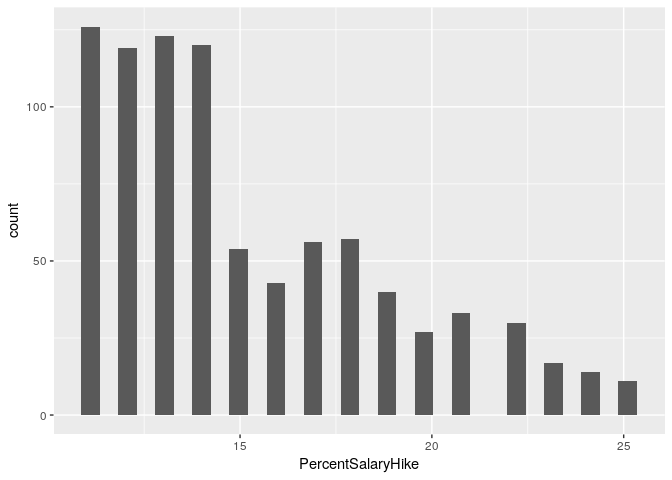

Exploratory Data Analysis
================
Stuart Miller
August 4, 2019

# Setup Environment

``` r
# import libraries
library(knitr)
library(tidyverse)
library(naniar)
library(Hmisc)
library(GGally)

# import helper functions
source('../helper/data_munging.R')

# read in data
train <- read_csv('../data/CaseStudy2-data_train.csv')
```

# Data Exploration

A data dictionary was not given. So start by exploring the variables to
get a sense of what is included. A simple data dictionary will be built.
See ‘./analysis/data/README.md’ for more details.

``` r
names(train)
```

    ##  [1] "ID"                       "Age"                     
    ##  [3] "Attrition"                "BusinessTravel"          
    ##  [5] "DailyRate"                "Department"              
    ##  [7] "DistanceFromHome"         "Education"               
    ##  [9] "EducationField"           "EmployeeCount"           
    ## [11] "EmployeeNumber"           "EnvironmentSatisfaction" 
    ## [13] "Gender"                   "HourlyRate"              
    ## [15] "JobInvolvement"           "JobLevel"                
    ## [17] "JobRole"                  "JobSatisfaction"         
    ## [19] "MaritalStatus"            "MonthlyIncome"           
    ## [21] "MonthlyRate"              "NumCompaniesWorked"      
    ## [23] "Over18"                   "OverTime"                
    ## [25] "PercentSalaryHike"        "PerformanceRating"       
    ## [27] "RelationshipSatisfaction" "StandardHours"           
    ## [29] "StockOptionLevel"         "TotalWorkingYears"       
    ## [31] "TrainingTimesLastYear"    "WorkLifeBalance"         
    ## [33] "YearsAtCompany"           "YearsInCurrentRole"      
    ## [35] "YearsSinceLastPromotion"  "YearsWithCurrManager"

# Reponse Variables

Two models are requested

  - A model for salary, which is given as `MonthlyIncome` in the
    dataset.
  - A model for attrition, which is given as `Attrition` in the dataset.

Histogram of monthly income reveals that it is highly skewed to the
right.

``` r
# histogram of MonthlyIncome
train %>% ggplot(aes(x = MonthlyIncome)) +
  geom_histogram(bins = 15)
```

<!-- -->

A bar plot of Attrition reveals that the response variable is highly
imbalanced.

``` r
# histogram of Attrition
train %>% ggplot(aes(x = Attrition)) +
  geom_bar()
```

<!-- -->

# Explanatory - Continuous Variables

Exploration of the continuous variables.

``` r
# create a vector of numeric features
features.numeric <- c('DailyRate', 'DistanceFromHome', 'Age', 'HourlyRate', 'MonthlyIncome', 'MonthlyRate',
           'NumCompaniesWorked','PercentSalaryHike', 'TotalWorkingYears', 'TrainingTimesLastYear',
           'YearsAtCompany','YearsInCurrentRole','YearsSinceLastPromotion', 'YearsWithCurrManager')
```

## Univariate Analysis

Explore features in isolation and the relationship between features and
the response variables.

**Correlation to Response**

The following table ranks features in order of descending correlation to
`MonthlyIncome`.

``` r
train.numeric <- train %>% select(features.numeric)

correlation.matrix <- rcorr(as.matrix(train.numeric))
train.corToMI <- data.frame(flattenCorrMatrix(correlation.matrix$r, correlation.matrix$P)) %>% 
  filter(row == 'MonthlyIncome' | column == 'MonthlyIncome') %>%
  mutate(cor = abs(cor)) %>%
  arrange(-cor)
kable(train.corToMI)
```

| row              | column                  |       cor |         p |
| :--------------- | :---------------------- | --------: | --------: |
| MonthlyIncome    | TotalWorkingYears       | 0.7785112 | 0.0000000 |
| MonthlyIncome    | YearsAtCompany          | 0.4913790 | 0.0000000 |
| Age              | MonthlyIncome           | 0.4842883 | 0.0000000 |
| MonthlyIncome    | YearsInCurrentRole      | 0.3618405 | 0.0000000 |
| MonthlyIncome    | YearsWithCurrManager    | 0.3284875 | 0.0000000 |
| MonthlyIncome    | YearsSinceLastPromotion | 0.3159116 | 0.0000000 |
| MonthlyIncome    | NumCompaniesWorked      | 0.1558943 | 0.0000038 |
| MonthlyIncome    | MonthlyRate             | 0.0645941 | 0.0568449 |
| MonthlyIncome    | PercentSalaryHike       | 0.0538659 | 0.1123575 |
| MonthlyIncome    | TrainingTimesLastYear   | 0.0390146 | 0.2503303 |
| DistanceFromHome | MonthlyIncome           | 0.0066672 | 0.8443188 |
| HourlyRate       | MonthlyIncome           | 0.0023912 | 0.9438534 |
| DailyRate        | MonthlyIncome           | 0.0000879 | 0.9979342 |

**Variance of Features**

The following table ranks features in order of descending standard
deviation.

``` r
# get varaince table
temp.table <- train %>%
  select(features.numeric) %>%
  summarise_all(funs(sd(.))) %>%
  rownames_to_column %>%
  gather(var, value, -rowname) %>%
  arrange(-value) %>%
  select(-one_of(c('rowname')))
# rename columns for clairity and print markdown table
names(temp.table) <- c('Feature','Standard Deviation')
kable(temp.table)
```

| Feature                 | Standard Deviation |
| :---------------------- | -----------------: |
| MonthlyRate             |        7108.381928 |
| MonthlyIncome           |        4597.695974 |
| DailyRate               |         401.116280 |
| HourlyRate              |          20.127163 |
| Age                     |           8.925950 |
| DistanceFromHome        |           8.136704 |
| TotalWorkingYears       |           7.513668 |
| YearsAtCompany          |           6.021036 |
| PercentSalaryHike       |           3.675440 |
| YearsInCurrentRole      |           3.639317 |
| YearsWithCurrManager    |           3.574441 |
| YearsSinceLastPromotion |           3.185872 |
| NumCompaniesWorked      |           2.520443 |
| TrainingTimesLastYear   |           1.272665 |

**`Age` exploration**

There appears to be a relationship between `Age` and `MonthlyIncome`. A
relationship between `Age` and `Attrition` is not clear.

``` r
train %>% ggplot(aes(x = Age)) + 
  geom_histogram(bins = 15)
```

<!-- -->

``` r
train %>% ggplot(aes(x = Age)) + 
  geom_histogram(bins = 15) + 
  facet_wrap(~ Attrition)
```

<!-- -->

``` r
train %>% ggplot(aes(x = Age, y = MonthlyIncome)) + 
  geom_point() + geom_smooth(method = 'lm')
```

<!-- -->

**`DailyRate` exploration**

There does not appear to be a correlation between `DailyRate` and either
outcome variable.

``` r
train %>% ggplot(aes(x = DailyRate)) + 
  geom_histogram(bins = 15)
```

<!-- -->

``` r
train %>% ggplot(aes(x = DailyRate)) + 
  geom_histogram(bins = 15) + 
  facet_wrap(~ Attrition)
```

<!-- -->

``` r
train %>% ggplot(aes(x = DailyRate, y = MonthlyIncome)) + 
  geom_point() + geom_smooth(method = 'lm')
```

<!-- -->

**`DistanceFromHome` exploration**

There does not appear to be a correlation between `DistanceFromHome` and
either outcome variable.

``` r
train %>% ggplot(aes(x = DistanceFromHome)) + 
  geom_histogram(bins = 15)
```

<!-- -->

``` r
train %>% ggplot(aes(x = DistanceFromHome)) + 
  geom_histogram(bins = 15) + 
  facet_wrap(~ Attrition)
```

<!-- -->

``` r
train %>% ggplot(aes(x = DistanceFromHome, y = MonthlyIncome)) + 
  geom_point() + geom_smooth(method = 'lm')
```

<!-- -->

**`MonthlyRate` exploration**

There does not appear to be a correlation between `MonthlyRate` and
either outcome variable.

``` r
train %>% ggplot(aes(x = MonthlyRate)) + 
  geom_histogram(bins = 15)
```

<!-- -->

``` r
train %>% ggplot(aes(x = MonthlyRate)) + 
  geom_histogram(bins = 15) + 
  facet_wrap(~ Attrition)
```

<!-- -->

``` r
train %>% ggplot(aes(x = MonthlyRate, y = MonthlyIncome)) + 
  geom_point() + geom_smooth(method = 'lm')
```

<!-- -->

**`PercentSalaryHike` exploration**

There does not appear to be a correlation between `PercentSalaryHike`
and either outcome variable.

``` r
train %>% ggplot(aes(x = PercentSalaryHike)) + 
  geom_histogram()
```

    ## `stat_bin()` using `bins = 30`. Pick better value with `binwidth`.

<!-- -->

``` r
train %>% ggplot(aes(x = PercentSalaryHike)) + 
  geom_histogram() + 
  facet_wrap(~ Attrition)
```

    ## `stat_bin()` using `bins = 30`. Pick better value with `binwidth`.

<!-- -->

``` r
train %>% ggplot(aes(x = PercentSalaryHike, y = MonthlyIncome)) + 
  geom_point() + geom_smooth(method = 'lm')
```

<!-- -->

**`TotalWorkingYears` exploration**

There does appear to be a correlation between `TotalWorkingYears` and
`MonthlyIncome`.

``` r
train %>% ggplot(aes(x = TotalWorkingYears)) + 
  geom_histogram(bins = 15)
```

<!-- -->

``` r
train %>% ggplot(aes(x = TotalWorkingYears)) + 
  geom_histogram(bins = 15) + 
  facet_wrap(~ Attrition)
```

<!-- -->

``` r
train %>% ggplot(aes(x = TotalWorkingYears, y = MonthlyIncome)) + 
  geom_point() + geom_smooth(method = 'lm')
```

<!-- -->

**`TrainingTimesLastYear` exploration**

There does not appear to be a correlation between
`TrainingTimesLastYear` and either outcome variable.

``` r
train %>% ggplot(aes(x = TrainingTimesLastYear)) + 
  geom_histogram(bins = 15)
```

<!-- -->

``` r
train %>% ggplot(aes(x = TrainingTimesLastYear)) + 
  geom_histogram(bins = 15) + 
  facet_wrap(~ Attrition)
```

<!-- -->

``` r
train %>% ggplot(aes(x = TrainingTimesLastYear, y = MonthlyIncome)) + 
  geom_point() + geom_smooth(method = 'lm')
```

<!-- -->

**`YearsAtCompany` exploration**

There does appear to be a correlation between `YearsAtCompany` and
`MonthlyIncome`.

``` r
train %>% ggplot(aes(x = YearsAtCompany)) + 
  geom_histogram(bins = 15)
```

<!-- -->

``` r
train %>% ggplot(aes(x = YearsAtCompany)) + 
  geom_histogram(bins = 15) + 
  facet_wrap(~ Attrition)
```

<!-- -->

``` r
train %>% ggplot(aes(x = YearsAtCompany, y = MonthlyIncome)) + 
  geom_point() + geom_smooth(method = 'lm')
```

<!-- -->

**`YearsInCurrentRole` exploration**

There does appear to be a correlation between `YearsInCurrentRole` and
`MonthlyIncome`.

``` r
train %>% ggplot(aes(x = YearsInCurrentRole)) + 
  geom_histogram(bins = 15)
```

<!-- -->

``` r
train %>% ggplot(aes(x = YearsInCurrentRole)) + 
  geom_histogram(bins = 15) + 
  facet_wrap(~ Attrition)
```

<!-- -->

``` r
train %>% ggplot(aes(x = YearsInCurrentRole, y = MonthlyIncome)) + 
  geom_point() + geom_smooth(method = 'lm')
```

<!-- -->

**`YearsSinceLastPromotion` exploration**

There does appear to be a correlation between `YearsSinceLastPromotion`
and `MonthlyIncome`.

``` r
train %>% ggplot(aes(x = YearsSinceLastPromotion)) + 
  geom_histogram(bins = 15)
```

<!-- -->

``` r
train %>% ggplot(aes(x = YearsSinceLastPromotion)) + 
  geom_histogram(bins = 15) + 
  facet_wrap(~ Attrition)
```

<!-- -->

``` r
train %>% ggplot(aes(x = YearsSinceLastPromotion, y = MonthlyIncome)) + 
  geom_point() + geom_smooth(method = 'lm')
```

<!-- -->

**`YearsWithCurrManager` exploration**

There does not appear to be a correlation between `YearsWithCurrManager`
and either outcome variable.

``` r
train %>% ggplot(aes(x = YearsWithCurrManager)) + 
  geom_histogram(bins = 15)
```

<!-- -->

``` r
train %>% ggplot(aes(x = YearsWithCurrManager)) + 
  geom_histogram(bins = 15) + 
  facet_wrap(~ Attrition)
```

<!-- -->

``` r
train %>% ggplot(aes(x = YearsWithCurrManager, y = MonthlyIncome)) + 
  geom_point() + geom_smooth(method = 'lm')
```

<!-- -->

## Multivariate Exploration

Scatter plot and correlation matrix gives a board overview of
correlations between continuous variables.

  - `MonthlyIncome` appears to be correlated with `Age` and
    `TotalWorkingYears`
  - `YearsAtCompany`,`YearsInCurrentRole`,`YearsSinceLastPromotion`,
    `YearsWithCurrManager`, `TotalWorkingYears`, and `Age` appear to be
    correlated.

<!-- end list -->

``` r
train %>%
  select(c(features.numeric)) %>%
  ggpairs()
```

<!-- -->

**Look at log of MonthlyIncome `logMI` because MonthlyIncome is right
skewed**

``` r
train <- train %>% mutate(logMI = log(MonthlyIncome))
train %>%
  select(c(features.numeric, 'logMI')) %>%
  ggpairs()
```

<!-- -->

**Close up of MonthlyIncome and highest correlated features**

Taking the log of MonthlyIncome does not appear to improve linear
correlation.

``` r
train %>%
  select(c('logMI','MonthlyIncome','Age','TotalWorkingYears','YearsAtCompany','YearsInCurrentRole',
           'YearsSinceLastPromotion','YearsWithCurrManager')) %>%
  ggpairs()
```

<!-- -->

``` r
train %>%
  ggplot(aes(x = YearsWithCurrManager, y = YearsAtCompany)) + 
  geom_point() + geom_smooth(method = 'lm')
```

<!-- -->

``` r
train %>%
  ggplot(aes(x = YearsInCurrentRole, y = YearsAtCompany)) + 
  geom_point() + geom_smooth(method = 'lm')
```

<!-- -->

``` r
train %>%
  ggplot(aes(x = YearsSinceLastPromotion, y = YearsAtCompany)) + 
  geom_point() + geom_smooth(method = 'lm')
```

<!-- -->
