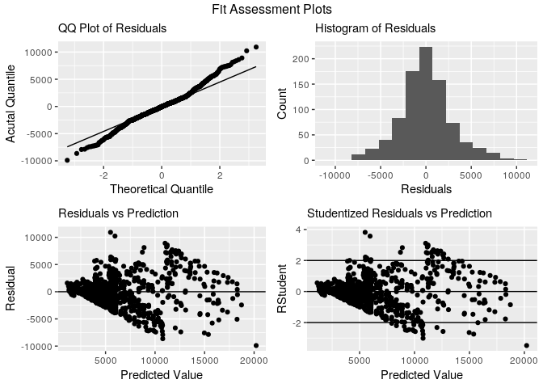

Modeling Income
================
Stuart Miller
August 9, 2019

From EDA, it appears that monthly income is correlated to
`TotalworkingYears`, `Age`, `YearsAtCompany`, `YearsInCurrentRole`, and
`YearsWithCurrentManager`.

``` r
model.linear <- train %>% lm(MonthlyIncome ~ TotalWorkingYears + Age, data = .)

summary(model.linear)
```

    ## 
    ## Call:
    ## lm(formula = MonthlyIncome ~ TotalWorkingYears + Age, data = .)
    ## 
    ## Residuals:
    ##     Min      1Q  Median      3Q     Max 
    ## -9895.2 -1580.8   -81.6  1479.1 10919.3 
    ## 
    ## Coefficients:
    ##                   Estimate Std. Error t value Pr(>|t|)    
    ## (Intercept)        1727.81     444.49   3.887 0.000109 ***
    ## TotalWorkingYears   492.92      17.19  28.670  < 2e-16 ***
    ## Age                 -21.33      14.47  -1.474 0.140807    
    ## ---
    ## Signif. codes:  0 '***' 0.001 '**' 0.01 '*' 0.05 '.' 0.1 ' ' 1
    ## 
    ## Residual standard error: 2885 on 867 degrees of freedom
    ## Multiple R-squared:  0.6071, Adjusted R-squared:  0.6062 
    ## F-statistic: 669.7 on 2 and 867 DF,  p-value: < 2.2e-16

``` r
train  %>% basic.fit.plots(., model.linear)
```

<!-- -->
