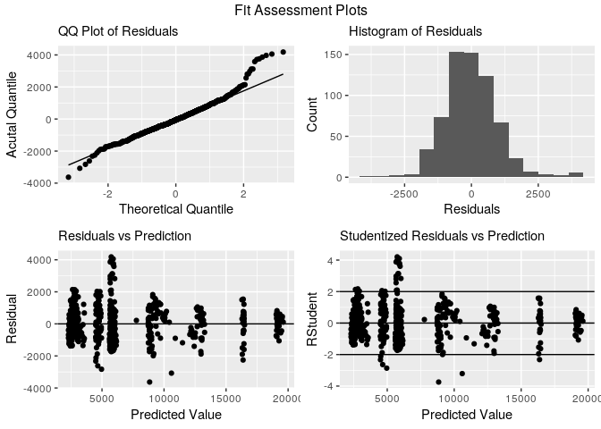
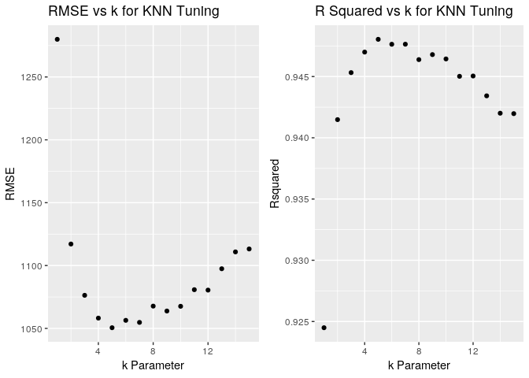

Modeling Income
================
Stuart Miller
August 9, 2019

## Data Partitioning

The training dataset will be split into a training set and a test set.
The training set `dfTrain` will be used for model cross validation. The
test set will be used for final model selection.

``` r
# split off a test set
trainIndex <- createDataPartition(train$MonthlyIncome , p = .75, 
                                  list = FALSE, 
                                  times = 1)
dfTrain <- train[trainIndex,]
dfTest <-  train[-trainIndex,]
```

## Helper Code

CV Runner - cross validate model on traning parition

``` r
train.cv <- function(model, method, folds){
  # Set up repeated k-fold cross-validation
  train.control <-trainControl(method = "cv", number = folds)
  # Train the model
  model.cv <-dfTrain %>% train(model,
                   data = .,
                   method = method,
                   trControl = train.control)
  # print model summary
  model.cv
}
```

## Model Construction

From EDA, it appears that monthly income is correlated to
`TotalworkingYears`, `Age`, `YearsAtCompany`, `YearsInCurrentRole`, and
`YearsWithCurrentManager`.

From the factors:

  - `JobLevel` appears to partion `TotalWorkingYears` and
    `MonthlyIncome` very well.
  - `JobRole` appears to partion `MonthlyIncome` very well.

The following models will be used to for regression: `Linear Regression`
and `k-Nearest Neighbors`.

### Linear Regression

Based on EDA, the following model will be used for linear
regression:

\[ \mu \lbrace MonthlyIncome \rbrace = \beta_0 + \beta_1 (JobLevel) + \beta_2(JobRole) + \beta_3(JobLevel)(TotalWorkingYears) \]

Estimate model on whole dataset and create fit assessement
plots.

``` r
model.linear <- dfTrain %>% lm(MonthlyIncome ~ JobLevel + JobRole + TotalWorkingYears:JobLevel, data = .)

summary(model.linear)
```

    ## 
    ## Call:
    ## lm(formula = MonthlyIncome ~ JobLevel + JobRole + TotalWorkingYears:JobLevel, 
    ##     data = .)
    ## 
    ## Residuals:
    ##     Min      1Q  Median      3Q     Max 
    ## -3629.4  -636.0   -54.6   571.5  4181.1 
    ## 
    ## Coefficients:
    ##                                Estimate Std. Error t value Pr(>|t|)    
    ## (Intercept)                    3525.635    235.267  14.986  < 2e-16 ***
    ## JobLevel2                      2017.032    275.241   7.328 7.10e-13 ***
    ## JobLevel3                      4411.859    346.865  12.719  < 2e-16 ***
    ## JobLevel4                      9693.381    743.476  13.038  < 2e-16 ***
    ## JobLevel5                     11466.179   1118.069  10.255  < 2e-16 ***
    ## JobRoleHuman Resources        -1052.801    299.298  -3.518 0.000467 ***
    ## JobRoleLaboratory Technician  -1229.608    211.522  -5.813 9.70e-09 ***
    ## JobRoleManager                 3403.863    279.517  12.178  < 2e-16 ***
    ## JobRoleManufacturing Director   216.701    189.703   1.142 0.253752    
    ## JobRoleResearch Director       3340.106    244.609  13.655  < 2e-16 ***
    ## JobRoleResearch Scientist      -988.438    210.953  -4.686 3.42e-06 ***
    ## JobRoleSales Executive           -3.489    166.234  -0.021 0.983259    
    ## JobRoleSales Representative   -1121.979    265.416  -4.227 2.71e-05 ***
    ## JobLevel1:TotalWorkingYears      54.695     16.180   3.380 0.000768 ***
    ## JobLevel2:TotalWorkingYears      20.371     16.614   1.226 0.220597    
    ## JobLevel3:TotalWorkingYears      88.811     17.728   5.010 7.07e-07 ***
    ## JobLevel4:TotalWorkingYears      -7.838     26.624  -0.294 0.768562    
    ## JobLevel5:TotalWorkingYears      33.647     41.231   0.816 0.414764    
    ## ---
    ## Signif. codes:  0 '***' 0.001 '**' 0.01 '*' 0.05 '.' 0.1 ' ' 1
    ## 
    ## Residual standard error: 1012 on 636 degrees of freedom
    ## Multiple R-squared:  0.9523, Adjusted R-squared:  0.951 
    ## F-statistic: 746.7 on 17 and 636 DF,  p-value: < 2.2e-16

``` r
dfTrain  %>% basic.fit.plots(., model.linear)
```

<!-- -->

Cross-validate model with linear
regression

``` r
model.formula <- MonthlyIncome ~ TotalWorkingYears:JobLevel + JobLevel + TotalWorkingYears:JobRole

# Eval model on 5 folds
lin.model.cv <- train.cv(model.formula, 'lm', 5)

# print model summary
lin.model.cv
```

    ## Linear Regression 
    ## 
    ## 654 samples
    ##   3 predictor
    ## 
    ## No pre-processing
    ## Resampling: Cross-Validated (5 fold) 
    ## Summary of sample sizes: 524, 523, 524, 522, 523 
    ## Resampling results:
    ## 
    ##   RMSE      Rsquared   MAE    
    ##   1039.095  0.9489788  782.845
    ## 
    ## Tuning parameter 'intercept' was held constant at a value of TRUE

``` r
# print md table with model performance
kable(data.frame('RMSE' = c(lin.model.cv$results$RMSE),
                 'Adj R Square' = c(lin.model.cv$results$Rsquared)))
```

|     RMSE | Adj.R.Square |
| -------: | -----------: |
| 1039.095 |    0.9489788 |

### K Nearest Neighbors Regression

Since KNN is a nonparametric model, a few correlated parameters will be
added `Age` and an interation between `JobRol` and `TotalWorkingYears`.
This will be compared to a benchmark model that was used for linear
regression.

#### KNN with Simpler Model

``` r
model.formula <- MonthlyIncome ~ TotalWorkingYears:JobLevel + JobLevel + TotalWorkingYears:JobRole

# Eval model on 5 folds
knn.model.cv <- train.cv(model.formula, 'knn', 5)

# print the model
knn.model.cv
```

    ## k-Nearest Neighbors 
    ## 
    ## 654 samples
    ##   3 predictor
    ## 
    ## No pre-processing
    ## Resampling: Cross-Validated (5 fold) 
    ## Summary of sample sizes: 524, 522, 524, 523, 523 
    ## Resampling results across tuning parameters:
    ## 
    ##   k  RMSE      Rsquared   MAE     
    ##   5  1084.881  0.9425402  780.6903
    ##   7  1136.737  0.9362810  787.7776
    ##   9  1190.500  0.9304230  832.3787
    ## 
    ## RMSE was used to select the optimal model using the smallest value.
    ## The final value used for the model was k = 5.

#### KNN with More Complex Model

``` r
model.formula <- MonthlyIncome ~ TotalWorkingYears:JobLevel + JobLevel + JobLevel:Age + TotalWorkingYears:JobRole + JobRole

# Eval model on 5 folds
knn.model.cv <- train.cv(model.formula, 'knn', 5)

# print the model
knn.model.cv
```

    ## k-Nearest Neighbors 
    ## 
    ## 654 samples
    ##   4 predictor
    ## 
    ## No pre-processing
    ## Resampling: Cross-Validated (5 fold) 
    ## Summary of sample sizes: 523, 523, 524, 523, 523 
    ## Resampling results across tuning parameters:
    ## 
    ##   k  RMSE      Rsquared   MAE     
    ##   5  1092.022  0.9426196  805.6264
    ##   7  1089.571  0.9429756  806.9606
    ##   9  1089.816  0.9430049  808.6483
    ## 
    ## RMSE was used to select the optimal model using the smallest value.
    ## The final value used for the model was k = 7.

#### Model Decisions

The more complex model appears to give a better R-Squared after CV. Then
model will be used to go farward with KNN.

With the model chosen for KNN, the parameter k will now be tuned.

##### Tune KNN regressor

5-fold CV is used to tune k over possible values of 1-15. Based on the
scatter plot of RMSE and R-Squared vs k, the performance appears to
flatten bewteen k = 4 and k = 9. k = 7 will be
chosen.

``` r
model.formula <- MonthlyIncome ~ TotalWorkingYears:JobLevel + JobLevel + JobLevel:Age + TotalWorkingYears:JobRole + JobRole

#model.formula <- MonthlyIncome ~ TotalWorkingYears:JobLevel + JobLevel + TotalWorkingYears:JobRole
#c(2,3,5,7,9,11,13,15)
knn.tuningGrid <- expand.grid(k = seq(1:15))

# Set up repeated k-fold cross-validation
train.control <-trainControl(method = "repeatedcv", number = 5)
# Train the model
model.cv <-dfTrain %>% train(model.formula,
                 data = .,
                 method ='knn',
                 trControl = train.control,
                 tuneGrid = knn.tuningGrid)
# print model summary
model.cv
```

    ## k-Nearest Neighbors 
    ## 
    ## 654 samples
    ##   4 predictor
    ## 
    ## No pre-processing
    ## Resampling: Cross-Validated (5 fold, repeated 1 times) 
    ## Summary of sample sizes: 523, 523, 523, 524, 523 
    ## Resampling results across tuning parameters:
    ## 
    ##   k   RMSE      Rsquared   MAE     
    ##    1  1279.942  0.9244934  934.8842
    ##    2  1117.111  0.9414826  836.9815
    ##    3  1076.322  0.9453203  805.0029
    ##    4  1058.182  0.9469974  800.5678
    ##    5  1050.539  0.9480395  785.7374
    ##    6  1056.412  0.9476359  796.9368
    ##    7  1054.779  0.9476406  797.7474
    ##    8  1067.731  0.9463828  804.5143
    ##    9  1063.825  0.9467923  801.1575
    ##   10  1067.593  0.9464378  803.3624
    ##   11  1080.791  0.9450193  815.5307
    ##   12  1080.461  0.9450447  812.9382
    ##   13  1097.454  0.9434250  824.7738
    ##   14  1110.859  0.9420062  836.9710
    ##   15  1113.183  0.9419726  840.4817
    ## 
    ## RMSE was used to select the optimal model using the smallest value.
    ## The final value used for the model was k = 5.

Plot k VS RMSE to visualize model tuning

``` r
k.values <- model.cv$results$k
RMSE <- model.cv$results$RMSE
Rsquared <- model.cv$results$Rsquared

knn.tune <- data.frame(k.values, RMSE, Rsquared)
p1 <- knn.tune %>% 
  ggplot(aes(x = k.values, y = RMSE)) + geom_point() + 
  scale_fill_few(palette = 'Dark') + 
  ggtitle('RMSE vs k for KNN Tuning') +
  xlab('k Parameter')

p2 <- knn.tune %>% 
  ggplot(aes(x = k.values, y = Rsquared)) + geom_point() + 
  scale_fill_few(palette = 'Dark') + 
  ggtitle('R Squared vs k for KNN Tuning') +
  xlab('k Parameter')

grid.arrange(p1,p2, ncol = 2)
```

<!-- -->

### Model Selection From Test

With the models chosen and tuned, they will be tested against a
validation set to see how well the models generalize to a new set of
data `dfTest`. This validation will be used for final model selection.

``` r
# helper function for calculating model performance
RMSE <- function(model, df){
  predictions <- predict(model, df)
  sqrt(mean((df$MonthlyIncome - predictions)^2))
}

knn.test.RMSE <- RMSE(knn.model.cv, dfTest)
lin.test.RMSE <- RMSE(lin.model.cv, dfTest)

knn.train.RMSE <- RMSE(knn.model.cv, dfTrain)
lin.train.RMSE <- RMSE(lin.model.cv, dfTrain)

kable(data.frame(
  Model = c('Linear Regression', 'KNN'),
  RMSE.Test = c(lin.test.RMSE, knn.test.RMSE),
  RMSE.Train = c(lin.train.RMSE, knn.train.RMSE),
  Abs.Difference = c(abs(lin.test.RMSE - lin.train.RMSE),
                     abs(knn.test.RMSE - knn.train.RMSE))
))
```

| Model             | RMSE.Test | RMSE.Train | Abs.Difference |
| :---------------- | --------: | ---------: | -------------: |
| Linear Regression |  981.2857 |  1004.6727 |        23.3870 |
| KNN               | 1078.4518 |   911.3372 |       167.1146 |
